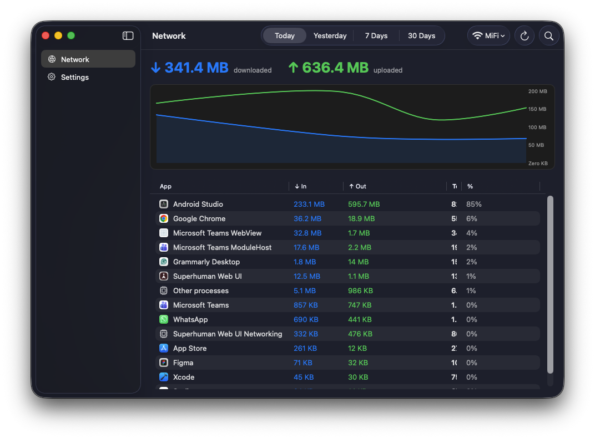
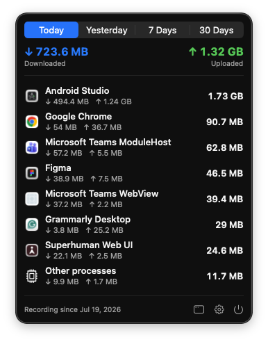
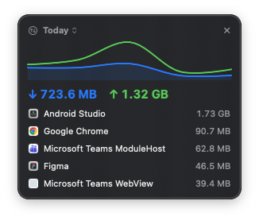
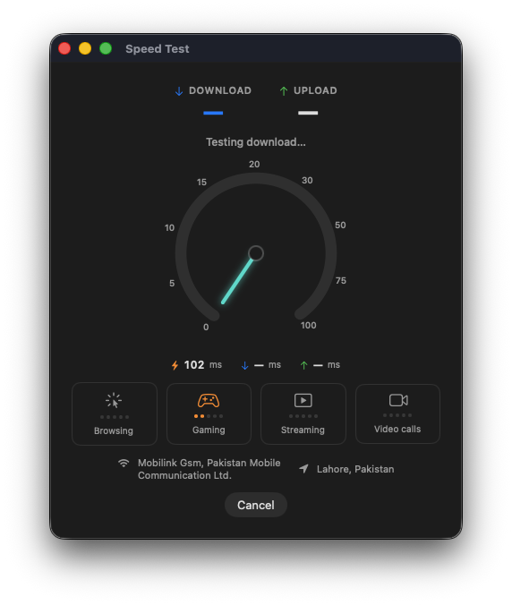
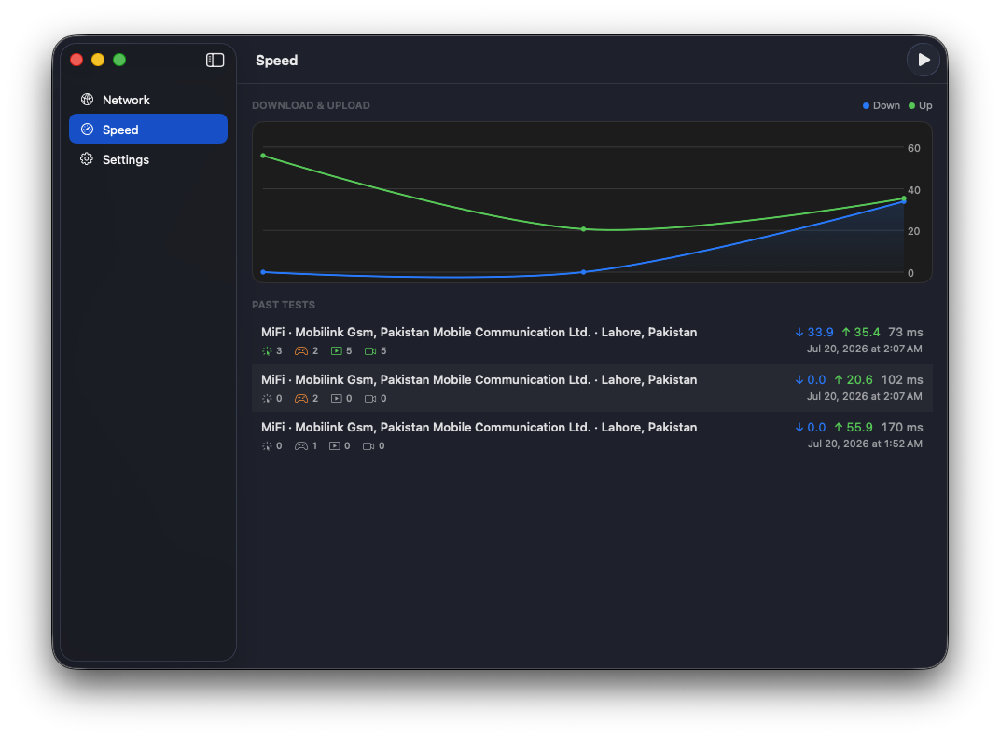
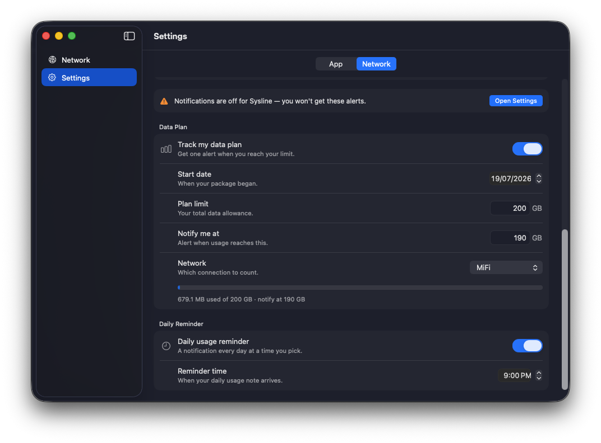
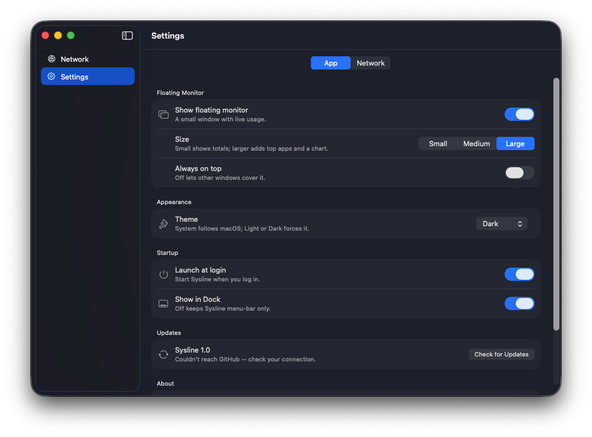

<div align="center">


# Sysline

**See which apps use your internet — and how much — over time.**

Free, open-source, on-device. A macOS menu bar app that records per-app network
usage so you can look *back*, not just watch live.



</div>

## Install

**One command — installs *and* updates.** Run it again any time to get the latest:

```bash
curl -fsSL https://raw.githubusercontent.com/azharbinanwar/Sysline/main/install.sh | bash
```

<sub>Not from Apple's App Store — it's a free open-source tool. The command handles the "unidentified developer" prompt for you. [Manual install ↓](#install--updating)</sub>

## Why

I lost **40 GB in 2 days** on a mobile hotspot and had no way to find out which
app did it. macOS doesn't keep history — Activity Monitor only shows bytes since
a process started, and forgets everything when the app quits or you reboot.

Sysline is the tool that should have existed: a lightweight logger + viewer that
remembers, so you can answer *"which app used my data, and how much, this week?"*

## Features

- **Per-app history** — download/upload per app for Today / Yesterday / 7 / 30 days, sorted, searchable.
- **Real app names + icons** — helper processes are folded into their parent app.
- **Wi-Fi breakdown** — tag usage by network and filter to one (e.g. isolate your hotspot to match your carrier's count).
- **Speed test** — a live download/upload test with a real-time gauge, ping + loaded latency, and per-activity ratings (Browsing / Gaming / Streaming / Video calls). Open it straight from the menu bar; history is kept with carrier and location. Free, uses Cloudflare's public endpoints — no account.
- **Floating monitor** — a small always-on-top HUD with live totals, top apps, and a trend chart. Small / Medium / Large.
- **Data-plan alerts** — set your plan limit + a "notify me at" value, get one alert when you cross it. Plus an optional daily usage reminder.
- **Light on resources** — ~0% CPU and near-zero energy at idle. Everything stays on your Mac.

## Install & updating

The command up top downloads the latest release, drops **Sysline.app** into
`/Applications`, launches it, and clears the quarantine flag so it opens without
warnings. **Re-run the same command any time to update.** Prefer to do it by
hand? Grab `Sysline.dmg` from
[Releases](https://github.com/azharbinanwar/Sysline/releases), drag it to
Applications, then **right-click → Open** the first time.

> Sysline isn't notarized by Apple (it's a free open-source tool), so macOS shows
> an "unidentified developer" prompt on a plain download. The install command
> handles that for you; the manual route just needs one right-click → Open.

**Updating:** re-run the install command, or use **Settings → App → Updates →
Check for Updates** inside the app.

## Screenshots

Small dialogs:

| Menu bar popover | Floating monitor | Speed test |
|---|---|---|
|  |  |  |

<div align="center">







</div>

## How it works

Sysline samples macOS's built-in `nettop` every few seconds, computes the
**delta** (what each process used since the last sample), tags it with the
current network, and stores it in a small SQLite database. Summing those deltas
over a date range gives per-app usage. No packet inspection, no kernel
extension — just polling a system tool and doing arithmetic.

Records only while running; launch-at-login keeps it almost always on.

## Privacy

100% on-device. Sysline makes **no network calls of its own** (the only
exception is checking GitHub for updates, which you control). No accounts, no
analytics, no telemetry. It's open source — read every line.

## Build from source

```bash
git clone https://github.com/azharbinanwar/Sysline.git
open Sysline/Sysline.xcodeproj   # Xcode 16+, macOS 14+
```

## License

[MIT](LICENSE) © 2026 Azhar Ali
